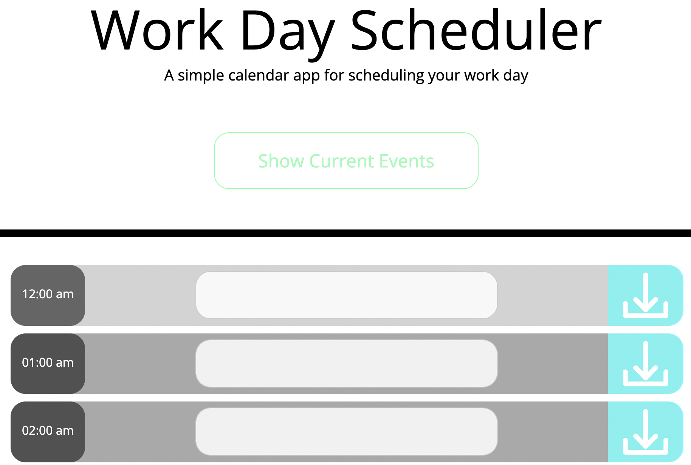

# Work Day Scheduler

<center>
</img>
</center>

## Table of Contents
  1. [Description](#description) 
  2. [Installation](#installation)
  3. [Usage](#usage)  
  4. [Contributing](#contributing)
  5. [Tests](#tests)
  6. [License](#license)
  7. [Questions](#questions)
  8. [E-mail](#e-mail)

## Description
This application is a modifiable hourly scheduler, which includes an indicator that shows how far through the day you are. There are input fields that tasks can be entered in, new and modified events will not save unless the save button is clicked after each entry/ modification. After the event has been saved or changed, the data is stored on the users local storage. 

## Installation
This application can be viewed by opening the ```index.html``` file from the directory in your default browser. There is no installation necissary for this application. 

## Usage
To use this application, you have to open the ```index.html``` file from the directory in your default browser. This application uses the local storage to save events. 

## Contributing
If you would like to contribute to this repository, feel free to reach out through the Github Page or see further contact information below.

## Tests
There are no tests designed for this application.

## License
 

## Questions
[github icon](./github-icon-small.png)
Github Profile: [dubosews](https://github.com/dubosews)
Contact Email: [wsd10205@gmail.com](mailto:wsd10205@gmail.com)
Directions for reaching out with further questions:
    If you have comments/ questions to share about this application, feel free to reach out to me through the Github repository. If you would like to reach out to me via email, linked above, ```Please include the TITLE of the GitHub repository in the subject line of the email```.
